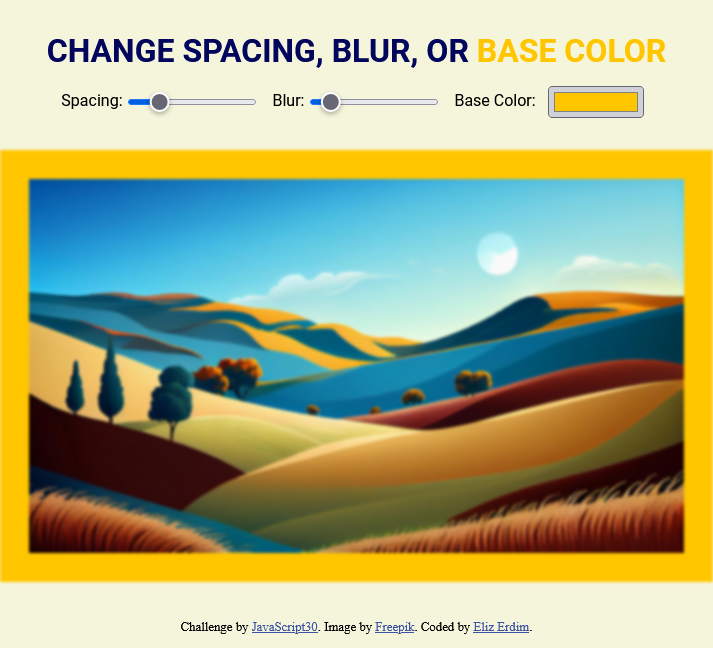

# JavaScript30 - JavaScript CSS Variables

This is a solution to the third challenge (Playing with CSS Variables and JS) from Wes Bos's [30 Day Vanilla JS Coding Challenge](https://javascript30.com/).

## Table of contents

- [Overview](#overview)
  - [The challenge](#the-challenge)
  - [Screenshot](#screenshot)
  - [Links](#links)
- [My process](#my-process)
  - [Built with](#built-with)
  - [What I learned](#what-i-learned)
  - [Continued development](#continued-development)
  - [Useful resources](#useful-resources)

## Overview

### The challenge

Users should be able to:

- Change the spacing, blur, and base color of the image on the screen
- View the optimal layout for the interface depending on their device's screen size

### Screenshot



### Links

- [View Code](https://github.com/elizerdim/javascript-css-variables)
- [Live Preview](https://elizerdim.github.io/javascript-css-variables/)

## My process

### Built with

- Semantic HTML5 markup
- CSS custom properties
- Flexbox
- JavaScript

### What I learned

- 'change', 'mousemove', and 'input' events in JavaScript

- document.documentElement.style.setProperty(propertyName, value) to manipulate CSS root variables

- 'git commit --amend --no-edit' command to add minor file changes to the latest commit

After watching the tutorial and learning about the new concepts, I wanted to complete the project on my own as much as possible. I went for a responsive design and did things somewhat differently. When I got stuck, I used Google instead of going back to the video and discovered the 'input' event to change the base color in real time, which was not used in the tutorial. I also looked up the contents of the 'e' objects in the console to fish out the values I needed. The following are a couple of snippets from my own code.

```js
function handleChange(e) {
  const unit = e.target.dataset.sizing || '';
  document.documentElement.style.setProperty(`--${e.target.id}`, e.target.value + unit);
}
```

```js
spacing.addEventListener('mousemove', handleChange);
blur.addEventListener('mousemove', handleChange);
baseColor.addEventListener('input', handleChange);
```

### Continued development

I want to get better at JavaScript DOM manipulation and learn further concepts, properties, events, and methods.

### Useful resources

- [document.documentElement](https://developer.mozilla.org/en-US/docs/Web/API/Document/documentElement) - MDN's reference for documentElement property on the document object. Returns the root element of the document.
- [setProperty() method](https://developer.mozilla.org/en-US/docs/Web/API/CSSStyleDeclaration/setProperty) - MDN's reference for setProperty() method. Sets a new value for a property on a CSS rule.
- ['input' event](https://stackoverflow.com/a/66065689) - I learned about the 'input' event in JavaScript from an answer to this StackOverflow entry. It updates the value of the manipulated property in real time.